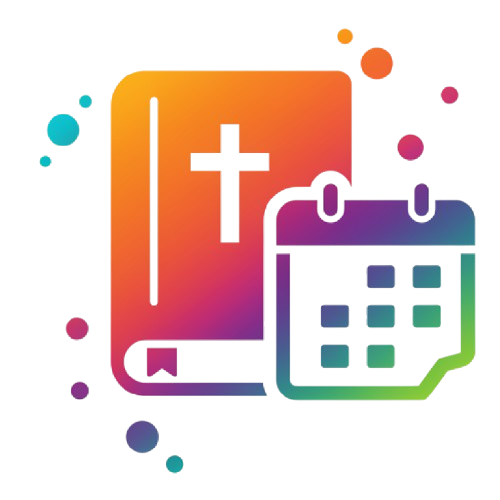

# 📚 Gerenciador de Planos de Leitura ✨

**Nunca mais perca o fio da meada em suas leituras!** Este aplicativo web ajuda você a criar, gerenciar e acompanhar seus planos de leitura de forma organizada e motivadora. Defina seus objetivos, equilibre sua rotina e mantenha-se em dia com suas metas literárias.

**➡️ Acesse a demonstração ao vivo:** [**Gerenciador de Planos de Leitura**](https://fernnog.github.io/Plano-leitura-livros/)

---

## 🚀 Principais Funcionalidades

*   **📅 Criação Flexível de Planos:**
    *   Defina o **título**, **páginas de início e fim** do livro.
    *   Escolha o período por **datas específicas** ou por **número de dias**.
    *   Selecione a **periodicidade**: leia **diariamente** ou apenas em **dias específicos da semana**.

*   **⚖️ Análise e Equilíbrio da Carga Semanal (NOVO!):**
    *   Clique no botão **"Reavaliar"** para visualizar um quadro completo da sua semana.
    *   Veja a **média de páginas por dia** somando todos os seus planos ativos.
    *   Identifique facilmente os dias sobrecarregados e tome decisões para **equilibrar sua rotina de leitura**.

*   **📊 Agendamento Inteligente:**
    *   O aplicativo calcula e distribui automaticamente as páginas a serem lidas em cada dia válido do seu plano.

*   **🔔 Painel de Controle Dinâmico:**
    *   **⚠️ Leituras Atrasadas:** Visualize rapidamente as tarefas de leitura mais antigas não concluídas.
    *   **🗓️ Próximas Leituras:** Veja um resumo das próximas leituras agendadas.

*   **✅ Acompanhamento de Progresso:**
    *   Marque cada dia de leitura como **concluído** com um simples clique.
    *   Visualize seu avanço com uma **barra de progresso** e **percentual concluído**.

*   **🚦 Status Visual do Plano:**
    *   Identifique o status de cada plano com tags coloridas: 🔵 **Próximo**, 🟢 **Em Dia**, 🟠 **Atrasado**, e ⚪ **Concluído**.

*   **🔄 Recálculo de Planos Atrasados:**
    *   Se um plano ficar atrasado, o app oferece opções para recalcular o cronograma.

*   **🔗 Link para Anotações:**
    *   Adicione um **link externo** (Google Drive, Notion, etc.) para acessar suas anotações.

*   **🗓️ Exportar para Agenda (.ics):**
    *   Exporte qualquer plano como um arquivo `.ics` para importar em sua agenda favorita.

*   **✏️ Gerenciamento Completo:**
    *   **Edite** ou **exclua** planos existentes a qualquer momento.

*   **☁️ Sincronização na Nuvem:**
    *   Seus planos são salvos automaticamente no **Firebase Firestore**, permitindo acesso de qualquer dispositivo com sua conta.

*   **📱 Design Responsivo:**
    *   Interface adaptada para uso confortável em desktops, tablets e smartphones.

---

## ✨ Screenshots (Sugestão)

*Inclua aqui algumas imagens ou GIFs mostrando as principais telas e funcionalidades:*

1.  **Tela Principal:** Visão geral dos planos com status e os painéis de controle.
2.  **Modal de Reavaliação de Carga:** A nova tabela mostrando a distribuição de páginas por dia da semana.
3.  **Detalhes de um Plano:** Card do plano expandido mostrando a lista de dias e o progresso.
4.  **Formulário de Criação/Edição:** Mostrando as opções de data, periodicidade, etc.

---

## 🛠️ Tecnologias Utilizadas

*   **Frontend:** HTML5, CSS3, JavaScript (ES6 Modules)
    *   A aplicação utiliza uma **arquitetura modular** em JavaScript puro para separar as responsabilidades, garantindo um código limpo, coeso e de fácil manutenção.
*   **Backend & Infraestrutura:** Firebase
    *   **Autenticação:** Firebase Authentication (Email/Senha)
    *   **Banco de Dados:** Firestore (NoSQL Database)
    *   **Hospedagem:** Firebase Hosting / GitHub Pages
*   **Design & Ícones:**
    *   Google Fonts (Roboto, Ubuntu)
    *   Material Symbols (Ícones)

---

## 🏛️ Arquitetura do Projeto

O projeto foi refatorado para usar uma arquitetura baseada em módulos ES6, onde cada arquivo tem uma responsabilidade única. Isso melhora a escalabilidade e a organização do código.

*   `main.js`: O **orquestrador** da aplicação. Inicializa os módulos e gerencia o fluxo de eventos principal.
*   `ui.js`: Responsável por **toda a manipulação do DOM**. Renderiza os componentes, mostra/esconde seções e modais.
*   `plano-logic.js`: Contém toda a **lógica de negócio**. Realiza cálculos, gera os dias do plano, analisa a carga semanal, etc., sem tocar no DOM.
*   `state.js`: Atua como a **fonte única da verdade**. Gerencia o estado da aplicação (usuário logado, lista de planos) de forma centralizada.
*   `auth.js`: Lida com todas as interações com o **Firebase Authentication** (login, logout, cadastro).
*   `firestore-service.js`: Gerencia a comunicação com o **Firestore** (salvar e carregar planos).
*   `dom-elements.js`: Centraliza a **seleção de todos os elementos do DOM**, exportando-os para que outros módulos possam usá-los.

---

## ⚙️ Como Usar

1.  Acesse o [link da aplicação](https://fernnog.github.io/Plano-leitura-livros/).
2.  **Cadastre-se** ou faça **Login** usando seu email e senha para salvar seus dados na nuvem.
3.  Clique em "**Novo**" para criar seu primeiro plano de leitura, preenchendo os detalhes.
4.  Acompanhe seus planos na tela inicial e marque os dias lidos nos detalhes de cada plano.
5.  Clique em **"Reavaliar"** no cabeçalho para abrir o quadro de análise e verificar quais dias da semana estão mais carregados.
6.  Use os painéis **Leituras Atrasadas** e **Próximas Leituras** para se manter organizado!
7.  Exporte para a agenda, edite ou exclua seus planos conforme necessário.
